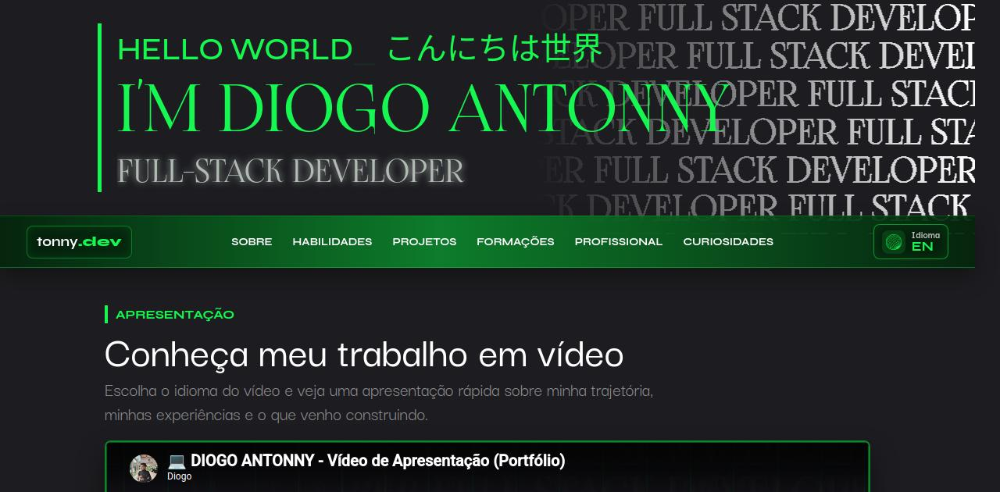
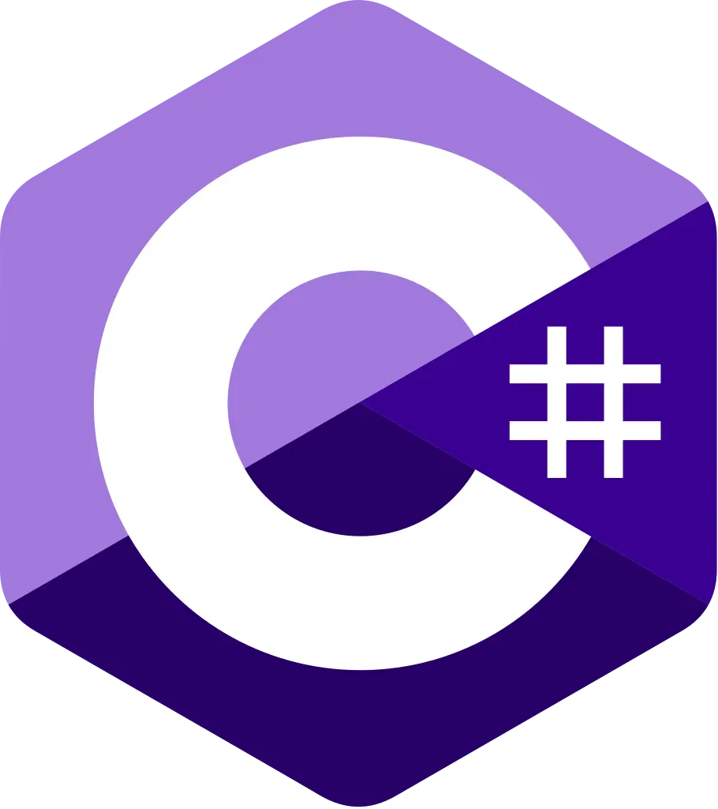
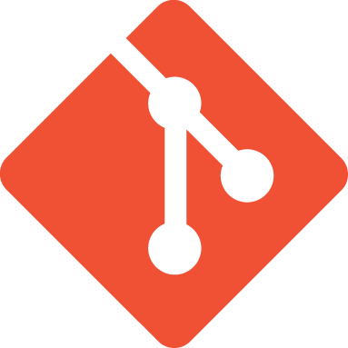

# D̸̘̩̦̜̥̓͗́͋̋͝͝I̷̞̪̙̺̼̍̀̀̏͒ͅO̶̡̰͓̿̓̍͋̾͊͘ͅG̷̛̜̮̪͒̐̽͆̄̑͜O̵͇̳̯̎̑̚͝  Ä̷̟͖̹́̇͂Ń̴̤͆̄̓͑͝T̶̝̲͋͋̈́͘O̶͙̹̽̀͊̏N̸͚̓̈́͑N̸̮̊͊͘͝Y̶͇͛͗

<p align="center">
  
</p>

<p align="center">
  <strong>開発 | 技術 | コード | 設計 | 実装 | 構築</strong>
</p>

<p align="center">
  <a href="https://diogojp202.github.io/Portfolio/"><strong>ACCESS PORTFOLIO</strong></a>
  ·
  <a href="https://diogojp202.github.io/Portfolio/?lang=en"><strong>EN VERSION</strong></a>
  ·
  <a href="https://github.com/DiogoJP202"><strong>GITHUB</strong></a>
</p>

```txt
> booting portfolio.interface
> loading identity............. OK
> syncing languages............ PT-BR / EN
> rendering skills............. HTML CSS JS C# .NET SQL
> opening wired_channel........ CONNECTED
> status....................... full-stack developer online

H̸̦͓̯̀̅͆̋̀͗̑ē̵̱̖̘͚̟̿͆̒͑́̀̍͑̓̅͒̎̕̕͠l̸̩̗̮̀̔̃̊̄̓͌̋́͂̃̈́̊̈́̈́̽̐͘͠l̵̟̼̄͒̌͗̀͛͌ͅớ̵̧̟̮͎̣̾̓͂̇̇͑́̾̀͊̔̚͝  w̵̢̻̌̈́͗̇͋̓̊͒́̈́͒̚͜͝o̴͎̾̆̔͒͌́̐̍̋̔͑̚̚͠͠r̸̹͖͊͒̿̏̈́̅̉l̵̮̎͒͝d̵̛̮̀̓̿̿̓̋̈́͆͒̿͒̽̄̿̏͗͑
```

## 001 // Preview

<p align="center">
  
</p>

Este repositório guarda meu portfólio pessoal, criado para apresentar minha trajetória como desenvolvedor full-stack, minhas experiências, projetos, stack técnico e um pouco da minha identidade visual: terminal, neon verde, glitch, kanjis e aquela energia de tecnologia meio experimental.

## 010 // Stack

<table>
  <tr>
    <td align="center"><br><strong>JavaScript</strong></td>
    <td align="center"><br><strong>React</strong></td>
    <td align="center"><br><strong>C#</strong></td>
    <td align="center"><br><strong>.NET</strong></td>
    <td align="center"><br><strong>SQL</strong></td>
    <td align="center"><br><strong>Git</strong></td>
  </tr>
</table>

```txt
技術  technology
コード  code
設計  architecture
実装  implementation
構築  build
開発  development
```

## 011 // Features

- Interface responsiva com versão desktop e mobile.
- Sistema de idioma dinâmico em português e inglês.
- Seções interativas de habilidades, projetos, formação e experiências.
- Projetos com modo case study: problema, solução, impacto, stack e aprendizado.
- SEO com Open Graph, Twitter Card, JSON-LD, sitemap e robots.
- Melhorias de performance com carregamento otimizado de fontes e imagens.
- Ajustes de acessibilidade com skip link, rótulos ARIA e redução de movimento.

## 100 // Project Map

```txt
.
├── index.html                 main interface
├── assets/pages/en.html        english redirect
├── css/
│   ├── style.css               visual system
│   ├── mediaQueries.css        responsive behavior
│   └── animations.css          motion and glitch energy
├── js/index.js                 i18n + interactive sections
├── robots.txt                  crawler rules
└── sitemap.xml                 search map
```

## 101 // Visual Identity

O site mistura uma base escura com verde neon, grid tecnológico, tipografia forte e detalhes inspirados em terminal, matrix e interfaces experimentais. A ideia é parecer um portfólio profissional, mas ainda com personalidade de quem gosta de criar jogos, automações, interfaces e coisas que parecem ter saído de um laboratório digital.

```txt
> protocol: green_line
> signal: 16F751
> mood: cyber / portfolio / full-stack / wired
> noise: █▓▒░ 010101 開発 技術 コード 設計 実装 構築 ░▒▓█
```

## 110 // Running Locally

Como é um projeto estático, basta abrir o `index.html` no navegador. Para testar rotas e recursos como se estivesse em servidor:

```bash
python -m http.server 8000
```

Depois acesse:

```txt
http://localhost:8000
```

## 111 // Contact

<p>
  <a href="https://www.linkedin.com/in/diogo-antonny/">LinkedIn</a>
  ·
  <a href="https://github.com/DiogoJP202">GitHub</a>
  ·
  <a href="https://linktr.ee/diogoantonny">Linktree</a>
</p>

```txt
> end_of_file
> connection still alive
```

<p align="center">
  
</p>

<p align="center">
  <strong>© Diogo Antonny</strong>
</p>
